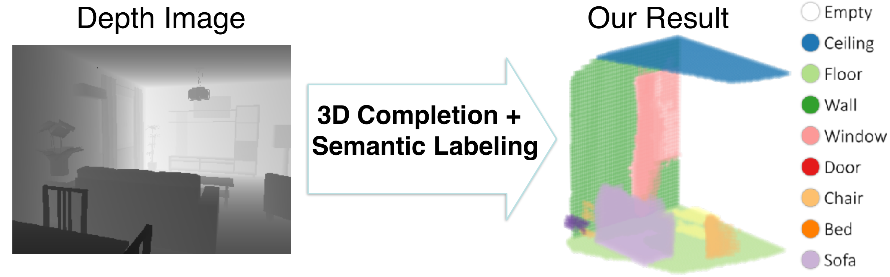
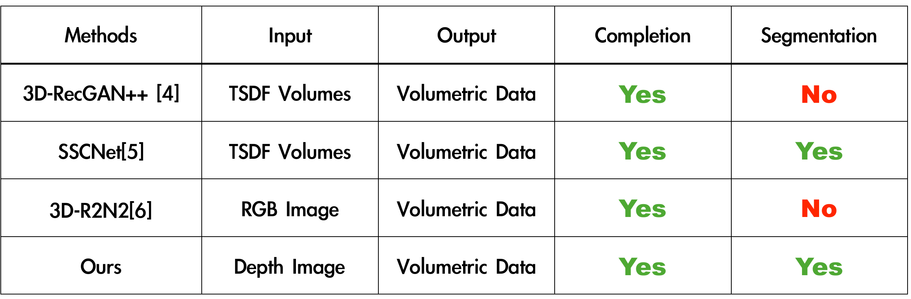
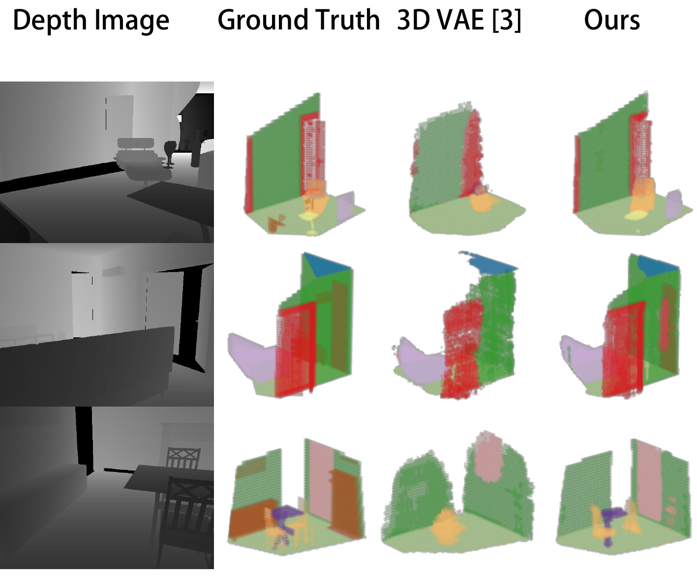

# Adversarial Semantic Scene Completion from a Single Depth Image

## Authors
**[Yida Wang](https://wangyida.github.io/#about), David Tan, Nassir Navab and [Federico Tombari](http://campar.in.tum.de/Main/FedericoTombari)**

*International Conference on 3D Vision*, IEEE

## Showcase
 
 
## Overview

We introduce a direct reconstruction method to reconstruct from a 2.5D depth image to a 3D voxel data with both shape completion and semantic segmentation that relies on a deep architecture based on 3D VAE with an adversarial training to improve the performance of this task.

## Architecture

We utilize the latent representation of 3D auto-encoder to help train a latent representation from a depth image. The 3D auto-encoder is removed after the parametric model is trained. This pipeline is optimized for the encoders for the depth image and the 3D volumetric data and the shared generator is also optimised during
training.

## Discriminators

To make the latent representation and the reconstructed 3D scene similar to each others, we apply two discriminators for both targets. In this manner, the latent representation of the depth produces the expected target more precisely compared to the latent representation of the ground truth volumetric data.

## Our data format

## Qualitative results

