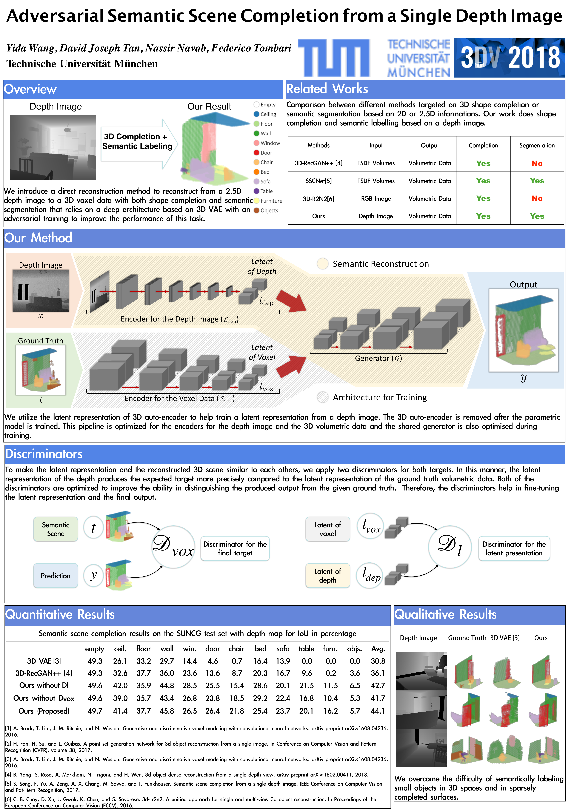

# Adversarial Semantic Scene Completion from a Single Depth Image

## Authors
**[Yida Wang](https://wangyida.github.io/#about), David Tan, Nassir Navab and [Federico Tombari](http://campar.in.tum.de/Main/FedericoTombari)**

*International Conference on 3D Vision*, IEEE

## Showcase
 

## Poster

