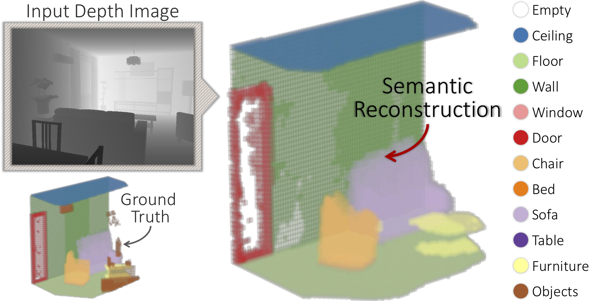
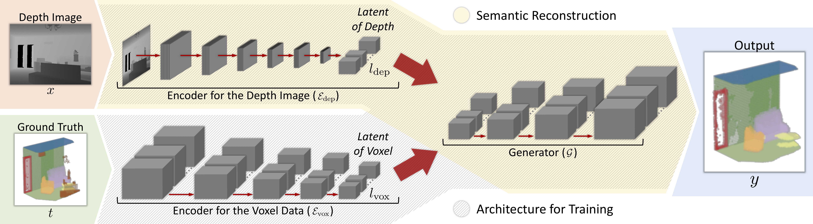
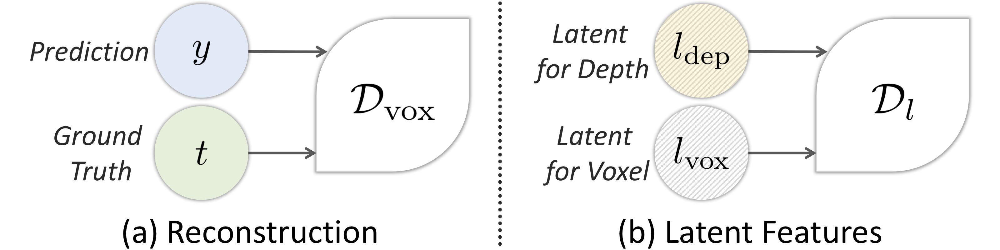

# Adversarial Semantic Scene Completion from a Single Depth Image

A method to reconstruct, complete and semantically label a 3D scene from a single input depth image

authors = **Yida Wang, David Tan, Nassir Navab and Federico Tombari**

*International Conference on 3D Vision*, IEEE

<video autoplay="autoplay" loop="loop">
	<source src="3dv/3dv_presentation.mp4" type="video/mp4" />
</video>

Our target | Animations
:----:|:----:
 | 

## Architecture

## Qualitative results

